# FLOWS.md — Component Flows (C4 L3)
> tevd-portal · Last updated: 2026-04-14
> Scope: Ambiguous zones only. Simple CRUD with no branching logic is not documented here.
> Tooling: Mermaid state and sequence diagrams.

---

## Index

1. [Auth & Role Sync](#1-auth--role-sync)
2. [Registration State Machine](#2-registration-state-machine)
3. [Payment Lifecycle](#3-payment-lifecycle)
4. [LOS Tree Propagation](#4-los-tree-propagation)
5. [Vital Signs](#5-vital-signs)

A flow is added here when a ticket produces ambiguity about state transitions, ownership boundaries, or sequencing. If a feature idea touches one of these flows, the flow diagram must be verified (and updated if it changes) before the ticket is executed.

---

## 1. Auth & Role Sync

### Problem this documents
Clerk owns the session. Supabase owns the profile. RLS policies read the Clerk JWT. This means two systems must agree on `role` at all times — and the sync is manual, not automatic.

### Clerk Webhook → Profile Creation

When a new user signs up via Clerk, a `user.created` webhook fires to `/api/webhooks/clerk`. This is the only place a `profiles` row is created for a new user.

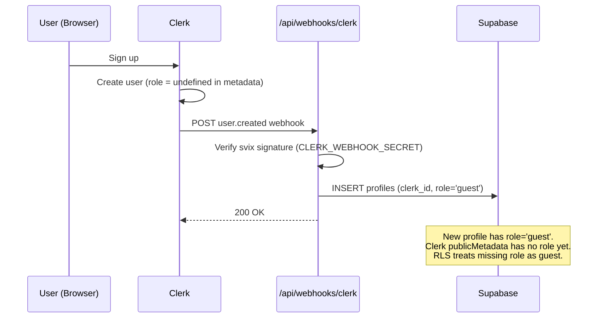

### Role Promotion

Role promotion happens through three admin routes. Every promotion is a two-write atomic operation: Supabase first, then Clerk. If the Clerk write fails, the Supabase write is not rolled back — this is a known gap. Re-login by the user will re-read Clerk metadata, but Supabase will already have the new role.

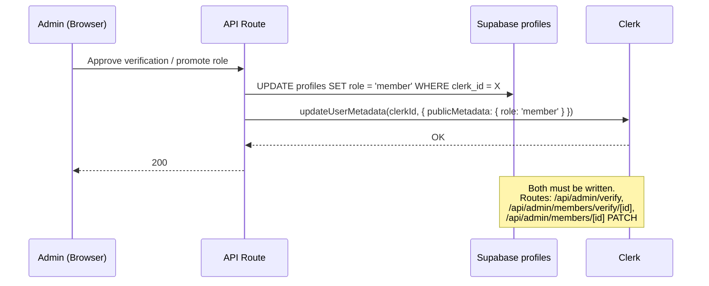

### RLS Auth Flow

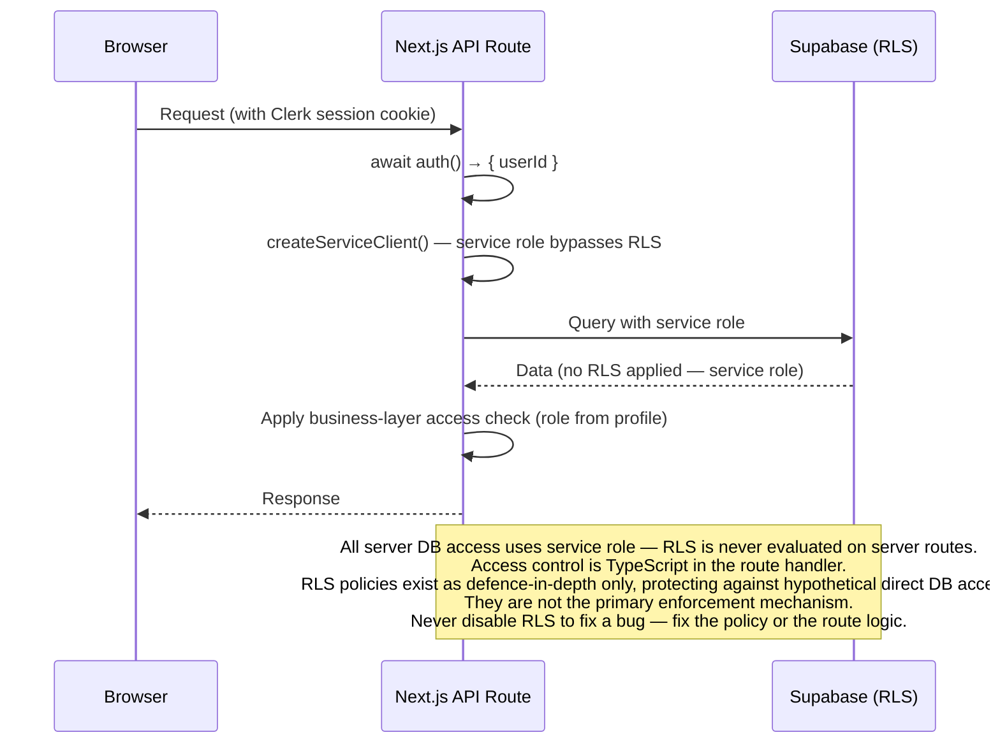

**Invariant:** The application never uses the anon key or a JWT Supabase client on the server. All server DB access is service role. RLS policies exist as a defence-in-depth layer, not the primary access control mechanism on the server.

---

## 2. Registration State Machine

### States

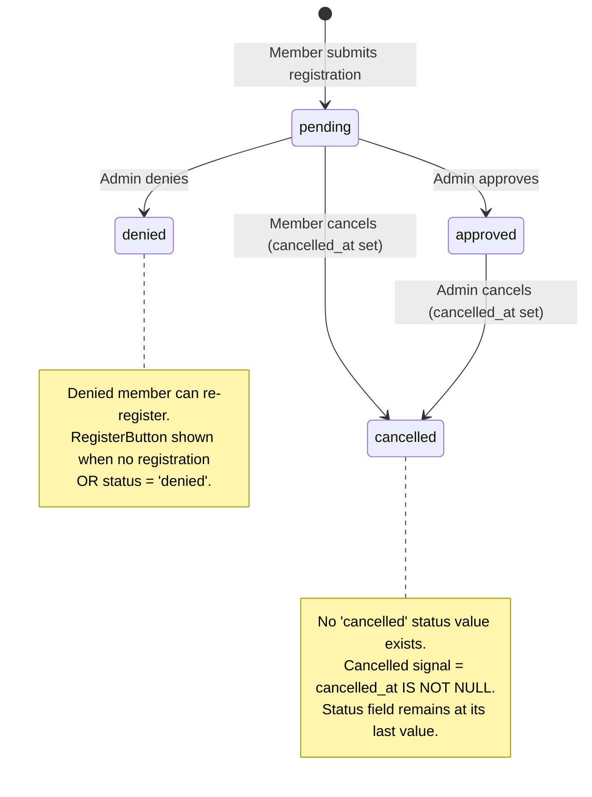

### Rules
- A member with `status = 'pending'` or `status = 'approved'` cannot register again for the same trip.
- A member with `status = 'denied'` OR no registration can register (RegisterButton is shown).
- Only `status = 'approved'` members see the "View Trip Details" button → `/trips/[id]`.
- Cancel routes: member → `POST /api/profile/trips/[id]/cancel`; admin → `POST /api/admin/trips/registrations/[id]/cancel`. Both set `cancelled_at`. 409 if already cancelled.
- `trip_registrations` has no `cancelled` enum value. Do not add one without a migration that also handles the cancelled_at signal.

---

## 3. Payment Lifecycle

### Context
tevd-portal has no payment processor. All payments are manual records — either submitted by members with proof, or logged directly by admins. Approval is a dual-gate: `admin_status` AND `member_status` must both be `approved` for a payment to be considered green.

Payments are always linked to exactly one entity: a trip (`trip_id`) OR a payable item (`payable_item_id`). The DB enforces this via a check constraint (`num_nonnulls(trip_id, payable_item_id) = 1`).

### Dual-Approval State Machine

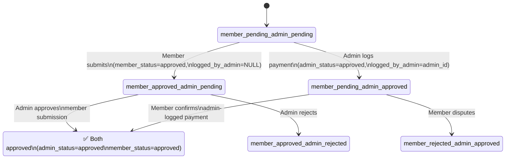

### Member Submission Flow

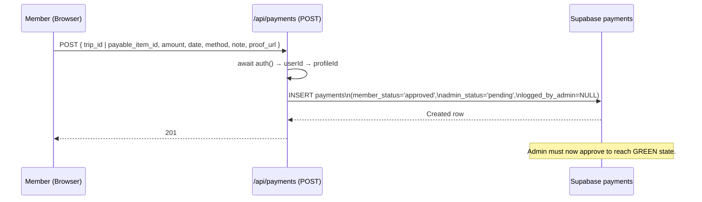

### Admin Logging Flow

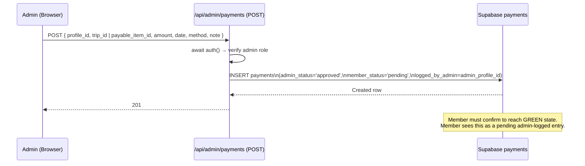

### Admin Status Update

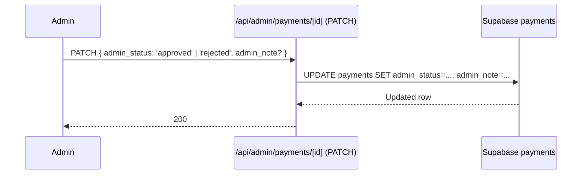

### Invariants
- `logged_by_admin IS NULL` → member-submitted. Member can update own admin-logged rows only.
- `logged_by_admin IS NOT NULL` → admin-logged. `admin_status` starts as `approved`.
- GREEN = `admin_status = 'approved' AND member_status = 'approved'`.
- Entity constraint is DB-enforced. API routes must pass exactly one of `trip_id` / `payable_item_id`.
- FK ambiguity: any PostgREST join from `payments` to `profiles` must use `profiles!profile_id(...)`.

---

## 4. LOS Tree Propagation

### Context
The organisation hierarchy is stored as a materialized path tree in `tree_nodes` using the PostgreSQL `ltree` extension. Each node has a `path` column (e.g., `100001.100045.p_abc123`) that encodes the full ancestor chain. This makes subtree queries O(log n) with a GiST index instead of recursive CTEs.

### Node Types
- **ABO node:** `path` label is the ABO number (e.g., `100001`)
- **No-ABO node:** `path` label is `p_<uuid_no_hyphens>` (e.g., `p_abc123def456`)
- On ABO assignment, the no-ABO label is renamed to the real ABO number and `rebuild_tree_paths` is called to cascade the rename down all descendants.

### Member Verification → Tree Placement

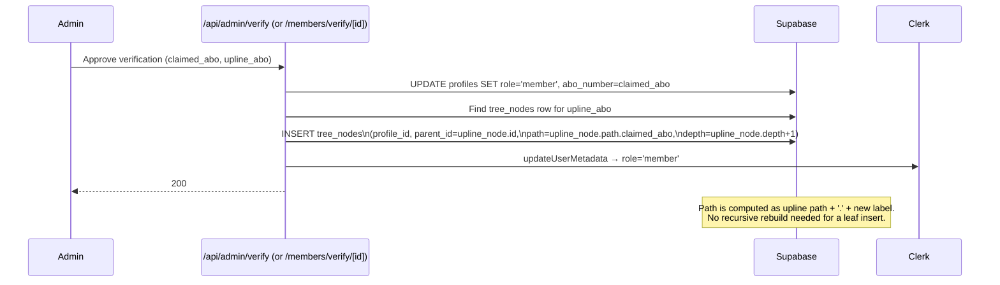

### No-ABO Placement (Manual Verification)

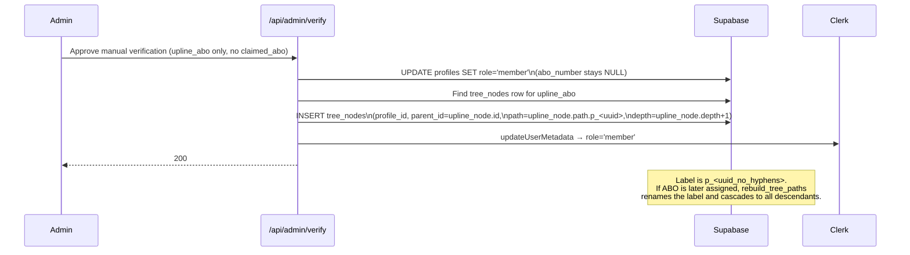

### Subtree Query Pattern

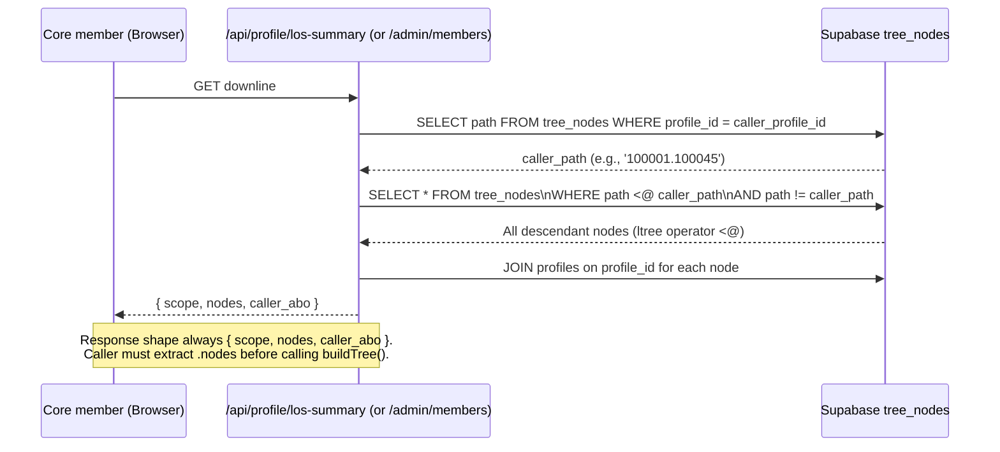

### Notification Fan-Out

Tree structure drives targeted notification delivery:
- `get_core_ancestors(uuid)` — returns Core-role profile UUIDs above the given node via ltree ancestor query
- `notify_role_request` — notifies admins + Core ancestors of the requester
- `notify_calendar_event_created` (Core-created) — fans down to all descendants + fans up to Core ancestors
- `run_los_digest` — pg_cron, 06:00 UTC daily, aggregates LOS activity into a single digest notification per member

### Invariants
- Every `tree_nodes` row has a `path` that is a valid ltree label chain matching the ancestor chain up to root.
- `rebuild_tree_paths` must be called after any ABO number assignment that renames a node label.
- LOS import always wins for tree positioning — manual placement is overridden on next import reconciliation.
- No-ABO labels (`p_<uuid>`) are internal identifiers. They are never displayed to users.

---

## 5. Vital Signs

> ✅ Status: **Stable / Implemented** — state model established via 2604-BUG-001 (PR #32) and API corrected via 2604-BUG-002 (PR #33), both 2026-04-14.

### Context

Vital signs track per-member health or qualification markers. Each sign belongs to a `vital_sign_definitions` category (admin-managed). Recording is admin-only — members have read access only. There is no dual-approval and no member confirmation step.

### Data Model

- `vital_sign_definitions` — admin-managed category/label definitions; `is_active` controls whether the definition appears in the member-facing matrix
- `member_vital_signs` — one row per `(profile_id, definition_id)`, UNIQUE constraint enforced at DB level
  - `is_active boolean NOT NULL DEFAULT true` — active/inactive toggle; row is never deleted
  - `recorded_at`, `recorded_by` — updated on every activate (upsert)

### State Machine

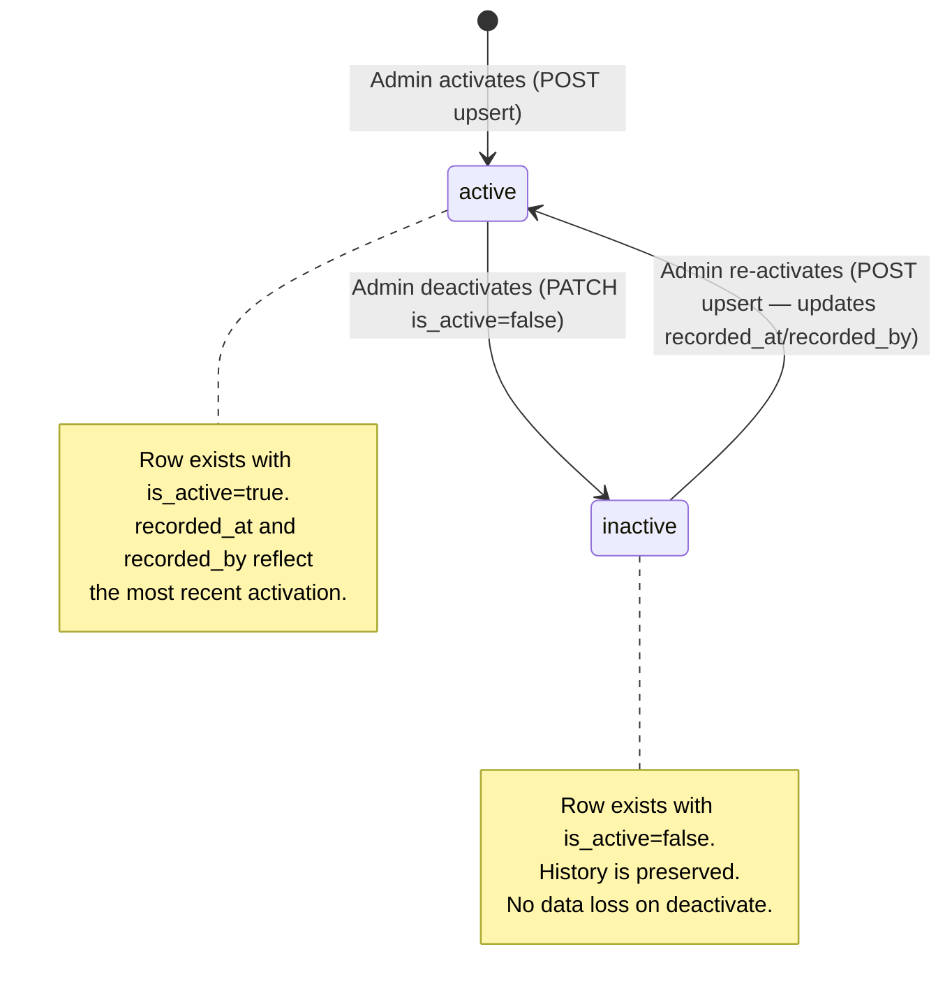

### Activate / Re-activate Flow

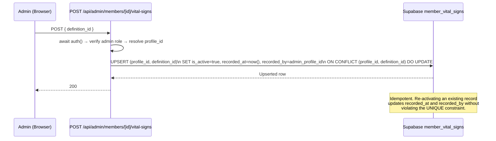

### Deactivate Flow

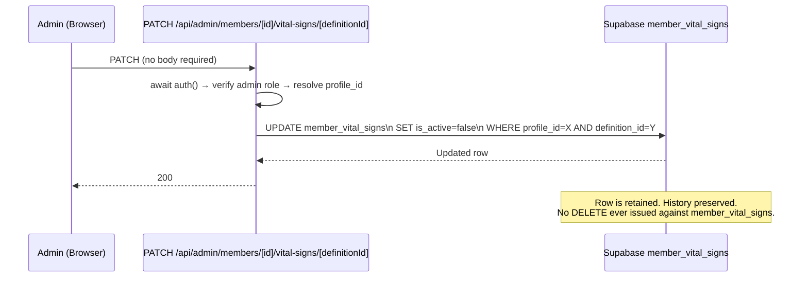

### Member Profile API (`/api/profile/vital-signs`)

Returns one entry per **active** `vital_sign_definitions` row (`.eq('is_active', true)`), left-joined against `member_vital_signs` for the requesting profile. Each entry carries `is_recorded` and `is_active` so the UI can distinguish unrecorded, recorded-active, and recorded-inactive states without additional queries.

### LOS Tree Surface (`/api/los/tree`)

The tree endpoint fetches **all** vital sign records for each member regardless of `is_active`, and surfaces `is_active` per record. Rendering decisions (active = underlined crimson, inactive = dimmed) are made at the component level (`NodeCard`), not at the query level.

### Invariants
- **Never DELETE from `member_vital_signs`.** Deactivate only (`is_active=false`).
- **Activate = upsert**, not INSERT. This is the only safe path given the UNIQUE constraint.
- Admin-only write access. Members read via `/api/profile/vital-signs` (returns `is_active` per record).
- `/api/profile/vital-signs` filters definitions by `is_active=true` — retired definitions do not appear in the member matrix.
- Definition toggle (enable/disable a definition globally) is a separate concern managed via `vital_sign_definitions` — it does not affect existing `member_vital_signs` rows.
